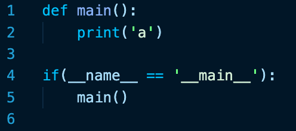
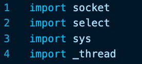
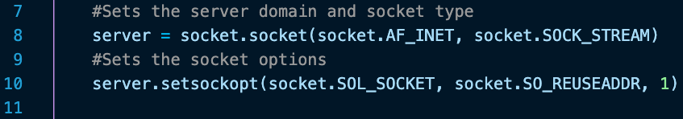
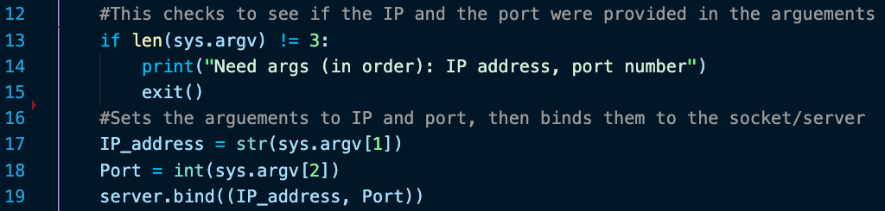
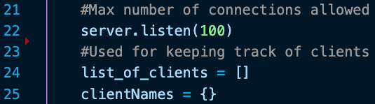

# Creating a python based chat application

The purpose of this is for understanding the network stack and the how python's libraries work. All in all, this project will start out simple and can be turned into a rather complex problem. In terms of agile, this is the first step with the first "sprint" being based on creating a working chat client and server. The following will include custom commands, bots, other data types that text (MIME), and encryption. So this is the rundown of my experience creating the first part.

### Disclaimer:

I have experience in working with networking, so I may overlook some details that seem common to me. I will try to make this as simple as possible for those who may not know python/networking/etc.

# Step 1: Understanging the layout of the software.

The first thing that should be done in any (somewhat difficult) project is a map of how things will work and interact.

#### So what are we building?

We are building an chat application: this means we could have two ways of communicating. The first is what's known as peer-to-peer. The second is the client-server model. The first is the talking directly to each client. This can be seen with torrents and some messaging clients. An example would be Omegle, which allows users to see each other's IP addresses. The latter is the standard model for most services today, which means that you, the consumer, connects to the company's servers. Thus the server acts as a middleman in the transaction of data.

For this project, I am going to choose to use the client-server model as its considered the norm and there are plenty of things we could build on with this model, namely custom commands and the ability to integrate more than 2 people within the chat reasonably.

# Step 2: Creating the server

The server is actually really simple, there are a couple of methods we need to create that perform the main functions of the program and were off.

As always, I create these lines of code that runs the program when called. This isn't really needed in this aspect, but for a beginner, this is rather helpful. The first is the creation of a method named "main" and it prints the letter 'a' when called. The if statement checks to see if this was the file called and runs the main method. See [this website for more info](https://www.geeksforgeeks.org/__name__-special-variable-python/)

Next I import the libraries(actually named modules in python) that I am going to use. The first is [socket](https://docs.python.org/3/library/socket.html) which is the networking library that is the backbone of the application. The next is [select](https://docs.python.org/3.8/library/select.html) which is used for IO timing. After that is [sys](https://docs.python.org/3.8/library/sys.html) which is used for getting the command line arguements. Finally is [_thread](https://docs.python.org/3.8/library/_thread.html) which is used for threading the application. Note that all these will be explained throughout the codebase.

Next is the code for creating the socket that the server is connected to. First and foremost: a socket is an IP address and a port number. This is the software iteration of it, so there are more options that are needed to be set to things go smoothly. The first line creates the socket object with the name of server. There are two parameters put into the object that is the protocol ([AF_INET](https://docs.python.org/3.8/library/socket.html#socket.AF_INET) is just saying that and IP and port will be supplied), and the socket type which is a stream meaning that bytes will being coming and going at a constant rate. 

This shows the checking if the arguements are provided are correct and assigns them to the proper things such as the IP or port number variables. This then assigns the IP and port number to the socket we created named "server"

    python asdf.py abc1 abc2

This shows the terminal command

    import sys
    print('arg1: ' + sys.argv[0] + '\narg2: ' + sys.argv[1] + '\narg3: ' + sys.argv[2])

And this being the code will produce the following output:

    arg1: asdf.py
    arg2: abc1
    arg3: abc2

So the first index of the system args is the python script itself.

These lines are limiting/tracking/naming clients that connect. The first telling the socket we created to listen for up to 100 clients to connect (this can be more or less, of your choosing). The next lines are a list of the clients objects, and the next will be a dictionary for referencing names to connections.

This is only the start of the chat application as the next port will be the methods needed to control the various actions that chat rooms would need to perform.

